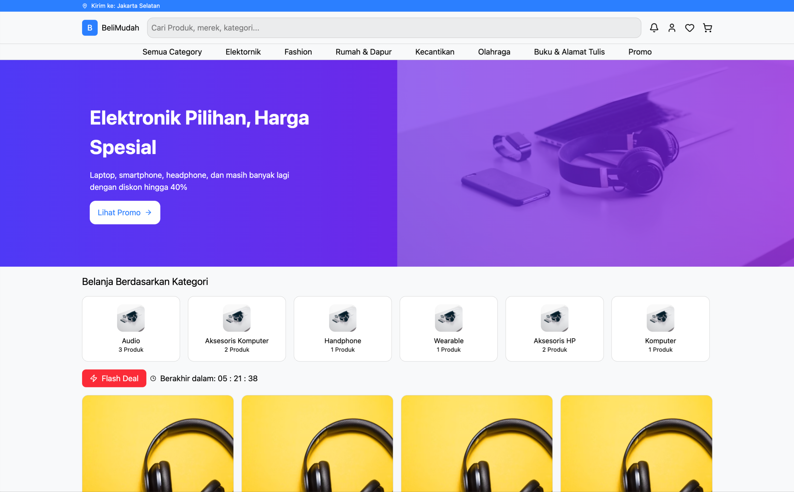
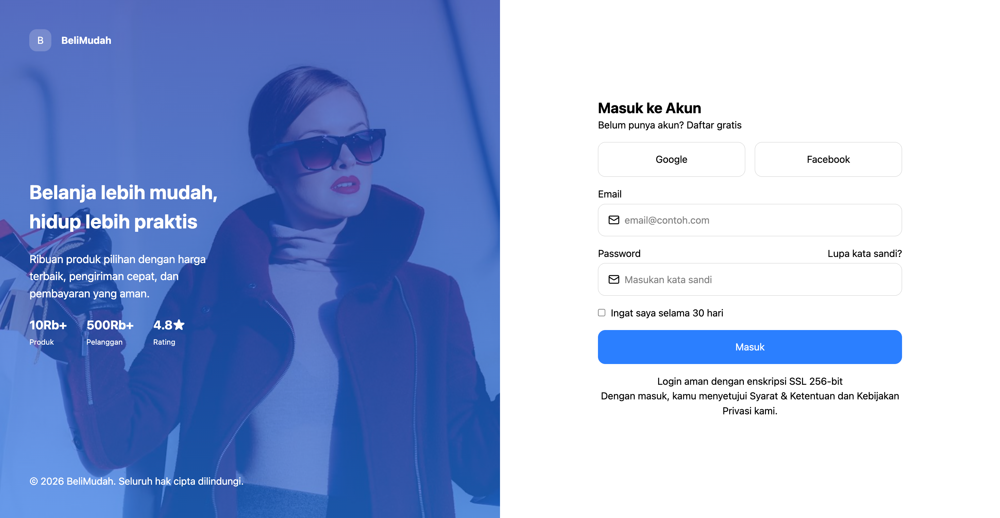
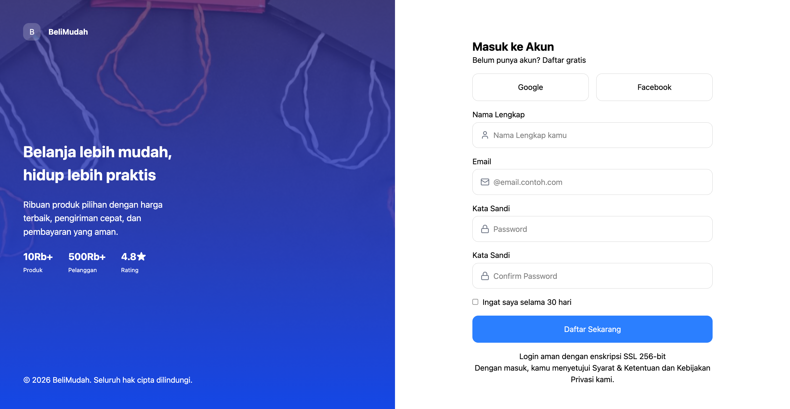

# **BeliMudah**

## Tech Stack 
- **Vite** - Next Generation Frontend Tooling
- **React** - A JavaScript library for building user interfaces
- **TailwindCSS** - A utility-first CSS framework for rapid UI development
- **React Router** - Declarative routing for React applications

## Features

### Product & Shopping
- **Search Params:** Dynamic filtering and searching of products through URL query parameters.
- **Category Filtering:** Browse products by category with dedicated filtering options.
- **Product Details:** View detailed product information before purchasing.
- **Add to Cart:** Add products to the shopping cart and manage quantities.

### Checkout Process
- **Address Management:** Add and select shipping addresses during checkout.
- **Payment Selection:** Choose a preferred payment method.
- **Order Confirmation:** Review and confirm order details before completing payment.
- **Payment Confirmation:** Display payment status and confirmation information.

### User Account
- **User Authentication:** Register and login to access personalized features.
- **Profile Management:** View and manage user profile information.
- **Order History:** Track previous purchases and order details.
## User Interface Preview

### 1. Landing Page (Home)


### 2. Authentication Interfaces

| Login Page | Register Page |
| :---: | :---: |
|  |  |

## Routing
```text
/
├── browser-product
├── product/:name
├── cart
│
├── sign-in
├── sign-up
│
├── checkout
│   ├── address
│   ├── payment
│   ├── confirm
│   └── success
│
├── profile
│   ├── address
│   └── setting
│
├── dashboard
│   └── product
│
└── * (Not Found 404)